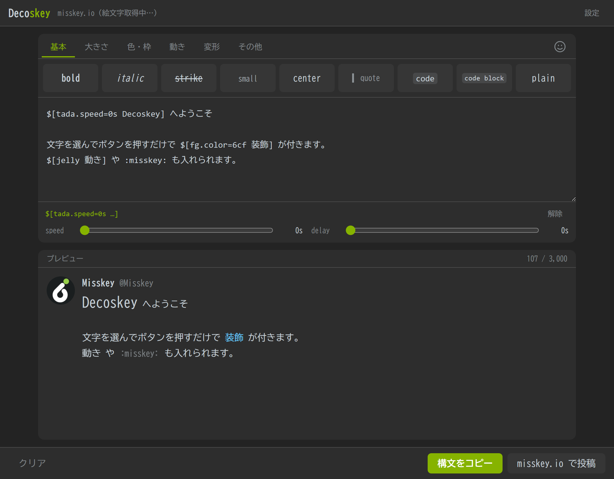

# Decoskey

A preview-first editor for Misskey's MFM markup.



## Features

- **Buttons that show what they do** — every button is labelled with the syntax it inserts (`bold`, `small`, `tada`, `x2` …) and renders that label with the decoration applied, so the button for a bouncing effect actually bounces.
- **Wrap a selection, nest freely** — select part of your text and press a button; the wrapped text stays selected, so pressing another button nests it (`**$[tada.speed=0s text]**`). Works the same with touch selection on a phone.
- **Live note preview** — the result is drawn the way Misskey draws it: avatar, display name, handle and body, in the Mi Dark / Mi Light palette. Animations, `x2`–`x4` scaling rules, borders, ruby and colours all follow the reference behaviour, and the "animated MFM" / "advanced MFM" switches let you check how the note looks for readers who turned them off.
- **Parameter sliders** — put the caret inside any `$[…]` and adjust `speed`, `delay`, `color`, `deg`, `width`, `radius` and the rest without touching the syntax by hand. One button removes the decoration again.
- **Custom emoji from any server** — the full emoji list is pulled from the configured host (misskey.io by default; over 13,000 entries), cached in IndexedDB for offline use, and browsed through a search-as-you-type picker with infinite scrolling.
- **Hand off the result** — copy the syntax to the clipboard, or open the server's share page with the text already filled in.
- **Installable** — a static PWA with no backend. Install it on a desktop or a phone home screen; drafts and settings stay on the device.

## Setup

```
npm install
npm run dev
```

Then open the printed URL. To produce a static build:

```
npm run build
```

The output in `dist/` is fully self-contained and can be served from any static host.

MFM parsing uses [mfm.js](https://github.com/misskey-dev/mfm.js); the renderer, styles and animations are an independent implementation of the documented MFM behaviour.

## License

Apache License 2.0
